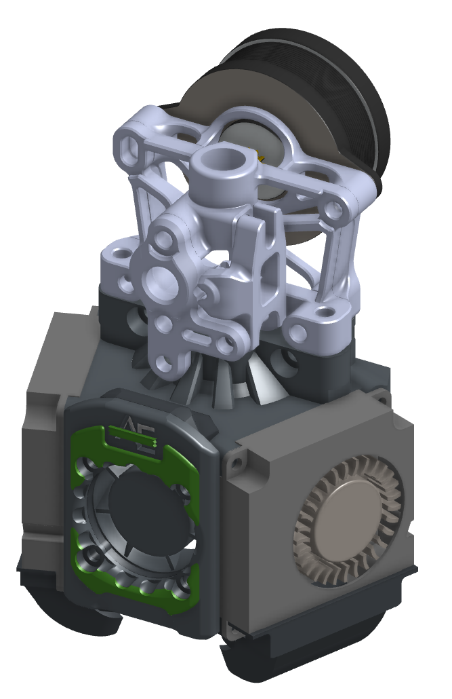

# LED mounts for Xol 2 using standard LED harness from Stealthburner

This mod uses the stock LED harness from Voron Stealthburner to add status and nozzle lights to Xol 2.

Depending on your build you will probably need a three wire extension between the Stealthburner LED harness and your toolhead board or standard wire harness.

There are now two versions to choose from. v1 is as per the render above. V2 is more compact and allows access to the bottom screw in the K-Plate if you use Sherpa Mini.

## What to print?
Print the ducts that suit your build. Standard or TAP availble for normal lenght or UHF length ducts are available

Print the faceplate parts for the version you want.
Both versions support neopixel and rainbow barf options.
Both versions require faceplate parts 1 & 2 and a diffuser to suit.
v1 requires an extra logo plate to be printed.

I recommend printing all of the faceplate parts, and diffuser parts in 0.1mm layer height 0.25 first layer will work fine.
Ducts can be printed the same as for standard Xol 2 ducts. Smaller layer heights may give you smoother walls on your ducts. I used 0.15mm layers.

## Assembly
This section is a work in progress.
for v2, standard neopixel versions, it works well to glue the white diffuser into the faceplate 1 part with a tiny drop of super glue.

## Wiring

Wires route under either side of the Xol 2 (behind a fan) and accross the 1st part of the faceplate where the status LED is inserted. Then behind the other fan before going down to the first duct. Then back accross to the other side under the 25mm hotend cooling fan behind the faceplate parts to the other duct. Look at the pictures below 😎

***Alternate wiring for non-UHF version.
You can put the 1st LED into the duct on the side all your wires go to first, then insert the 2nd LED into the "Status LED" location, and finally, the 3rd LED goes down to the other duct. If you insert the LEDs in this order, you will have to update your LED .cfg to make sure that the status LED is index #2 and that the others are index 1 and 3.

The cutout behind the updated front faceplate leaves space for the wires routed above the 25mm hotend cooling fan.

Only the front faceplate parts and ducts are changed from the standard hotend mounts and it uses the same m2 heatsets that would be used for stock Xol 2.

